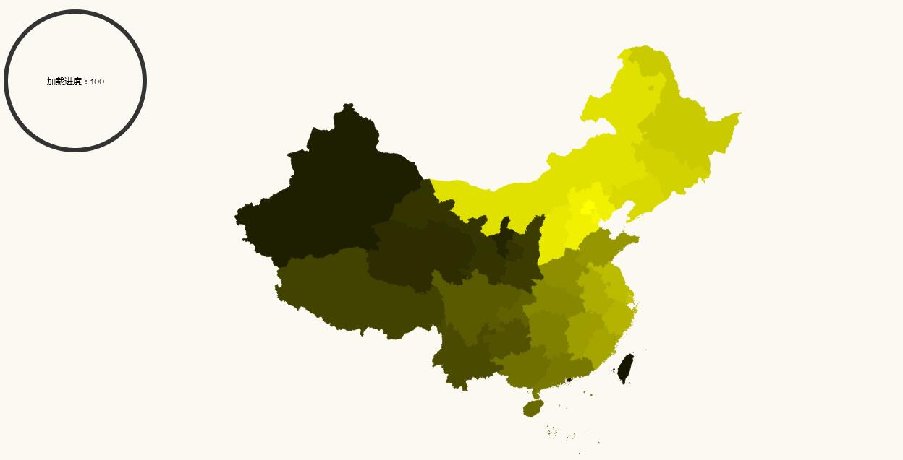
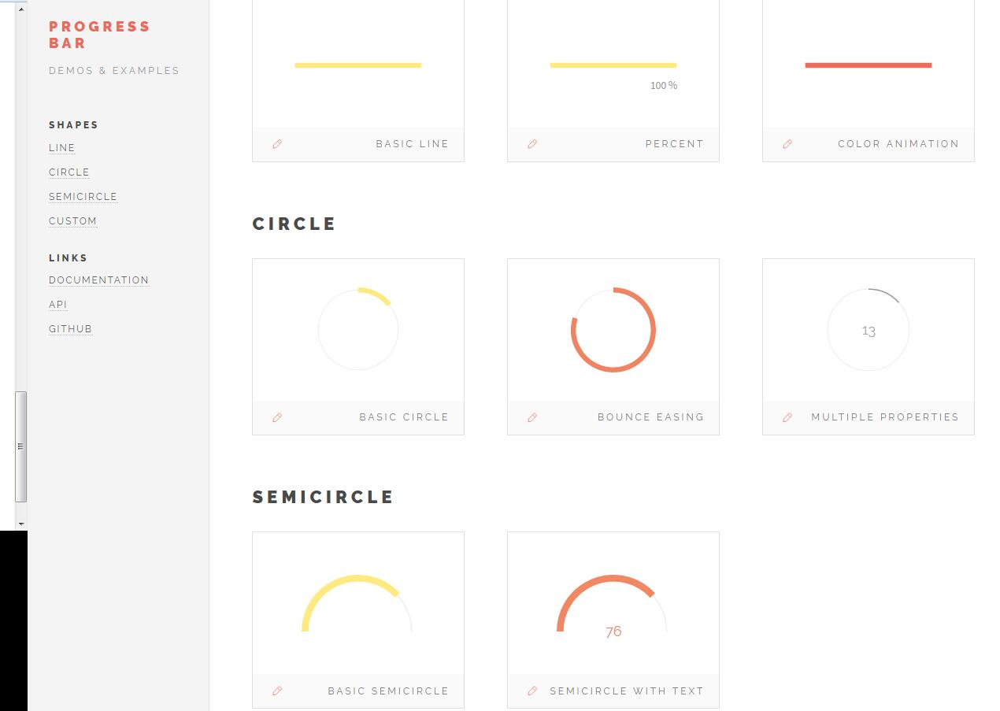
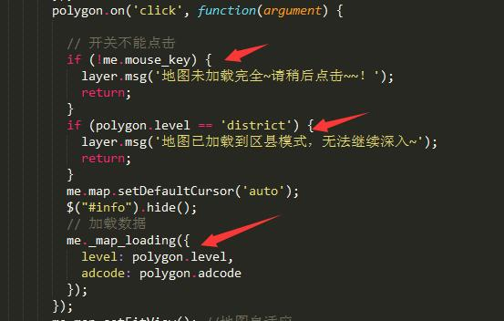

# 【一】高德地图  版块化全国地图到区县~c~

### 1.run

```
* $ git clone 地址
* npm install 
* $ gulp;
```

### 2.directions

* 此项目是 [市区监控(版块化)](https://github.com/zc3hd/demo_Gaode_shi_qu_trail_area_version) 的前面展示的区块的demo。原项目只是市层面下面的区县版块的展示。
* 该demo从全国版块地图到区县的版块的渲染。其中有版块的加载进度显示。

### 3.demo start：

#### 3.1 全国数据：

* 抽象为一个公共方法，设置要那数据的层和adcode:


* 拿到数据后进行把请求的数据挂载到全局，递归式进行模块渲染：


#### 3.2 进度条：

* 由于版块我是递归式的一个个加载，原因是版块的请求数据是异步的。我需要在上一个版块完全渲染完成后再进行下一个版块的请求和渲染，这个时候我就需要个进度条来表示我当前的请求数据在哪里的进度。



* 推荐学习比较酷炫的进度条：[progressbar](https://kimmobrunfeldt.github.io/progressbar.js/)



#### 3.3 安全开关：

* 在渲染版块的时候都绑定了点击事件：



* 可以看出当me.mouse_key为false的时候，点击版块会提醒没有加载完成版块的。在版块递归加载完成时才设置me.mouse_key为true，也就是可以点击请求下层的数据

### 4.小结

* 因为这个demo是[市区监控(版块化)](https://github.com/zc3hd/demo_Gaode_shi_qu_trail_area_version) 项目后写的。因为项目中我只需要是市下面区县的数据，所以在项目中我是拿到所有的区县的adcode进行for循环请求的数据，没有特别不好的体验，实质原因就是请求的数据比较少，也比较好渲染。
* 该demo不同，从一开始请求全国的数据。全国的数据量较大，如果继续按照for请求各省的数据，会让浏览器奔溃，这也就是我用递归完成数据的请求渲染。不过确实这是相对项目比较好的请求方法。
* 此demo可以作为省市区的聚合版块的展示。


 
